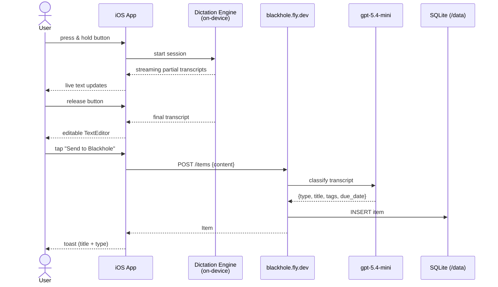
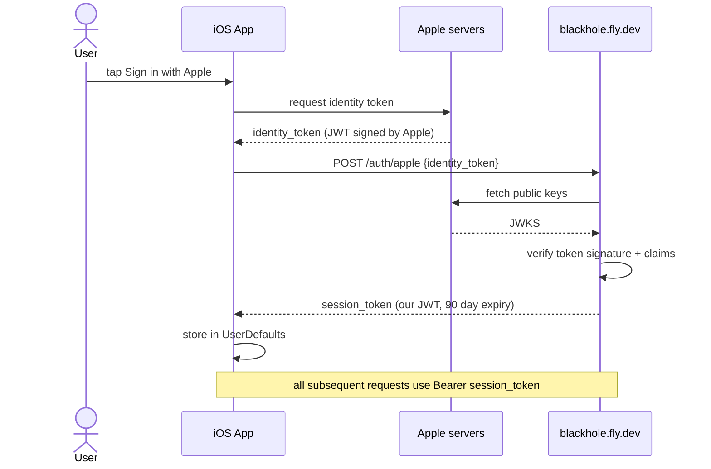
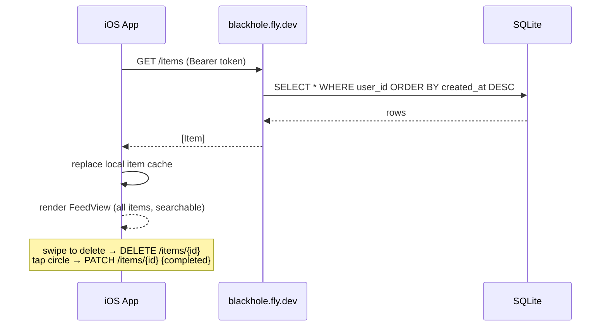
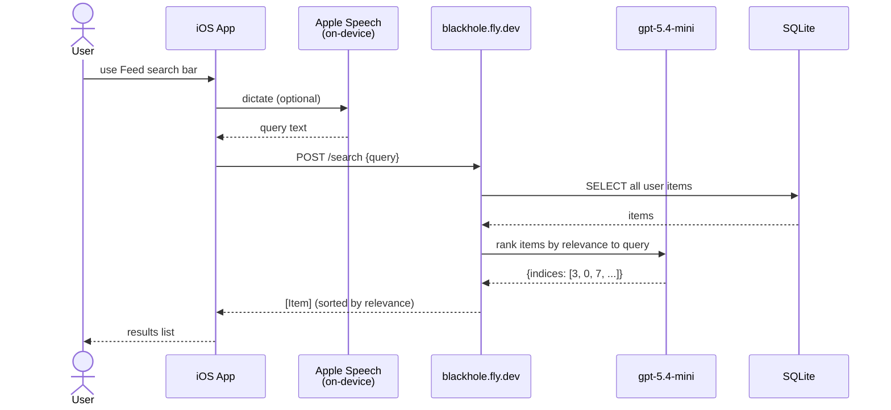

# blackhole — architecture

## Ingest (voice → stored item)



---

## Auth (Sign in with Apple)



---

## Feed (list items)



Feed, Epics, Notes, and Todos hydrate from the local item cache first, then refresh from `/items`. If the refresh fails, cached content remains visible.

---

## Feed search (natural language query)



If `/search` is unavailable, Feed search falls back to simple local matching over cached title, content, tags, and item type.

---

## Component map

```
blackhole/
├── ios/                        iOS client (SwiftUI, iOS 17+)
│   ├── Sources/Dictation/      on-device transcription
│   │   ├── AppleSpeechDictationEngine   uses SFSpeechRecognizer
│   │   └── WhisperKitDictationEngine    uses Core ML (tiny.en model)
│   ├── Sources/Ingest/         hold-to-dictate + submit flow
│   ├── Sources/Feed/           feed search + notes list + shared item detail
│   ├── Sources/Search/         legacy search screen, not mounted in tabs
│   ├── Sources/Auth/           Sign in with Apple
│   └── Sources/API/            HTTP client → blackhole.fly.dev
│
└── backend/                    API server (FastAPI, Python 3.12)
    └── app/
        ├── main.py             routes: /auth/apple /items /search
        ├── auth.py             Apple JWT verification + session JWT
        ├── analysis.py         compatibility facade for LLM operations
        ├── agent/responses/    OpenAI Responses client, prompts, logs, tool registry
        └── db.py               SQLite via stdlib sqlite3, WAL mode
```

## Item classification

The model (`gpt-5.4-mini`) decides based on the raw transcript. No hard rules — it reads intent. Signals it uses in practice:

| Signal | Likely classification |
|---|---|
| Action verb ("call", "buy", "fix", "remind me") | todo |
| Explicit date/time ("by Friday", "tomorrow at 3") | todo + extracts due_date |
| Informational / reflective content | note |
| Ideas, observations, references | note |
| Project/workstream/goal language ("create an epic", "Q2 launch") | epic |

Document-like captures should generally stay as one note because the raw user content is the source of truth. The model only splits when the user clearly gives distinct todos or asks for separate notes/items.

To tune this, edit the prompts in `backend/app/agent/responses/prompts.py`.
