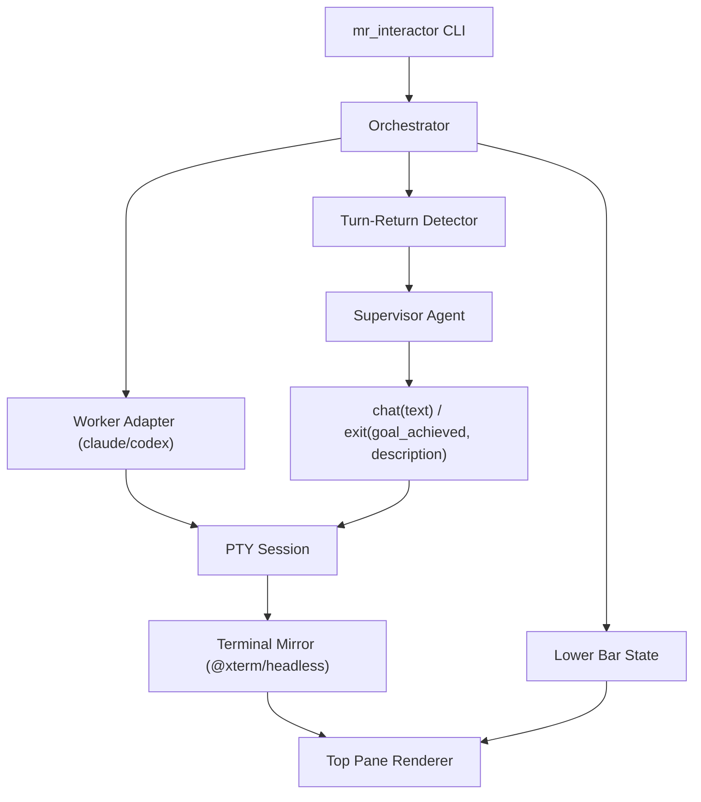

# MR_interactor

`MR_interactor` is a two-tier terminal agent runner:

- top pane: a real `claude` or `codex` session running in its own PTY
- bottom bar: a supervisor agent that only acts when the worker is waiting for input

This should be a tmux-like renderer, not actual tmux. A single Node process should own the worker PTY, mirror the terminal state, and paint the combined UI.

## Recommendation

Build v1 in TypeScript on Node 20+.

Why:

- [`@mariozechner/pi-tui`](https://github.com/badlogic/pi-mono/tree/main/packages/tui) already gives differential terminal rendering.
- [`terminalcp`](https://github.com/badlogic/terminalcp) proves the PTY + `@xterm/headless` pattern for AI-controlled CLIs.
- The OpenAI JS SDK fits the supervisor side cleanly.

Python is viable, but it adds more custom terminal work for no clear upside here.

## Product Shape

The user starts `MR_interactor` with the worker name directly:

- `mr_interactor claude`
- `mr_interactor codex`

Example:

```bash
mr_interactor codex --max-steps 50
```

At runtime:

1. Spawn the worker CLI inside a PTY.
2. Mirror the worker screen into the main pane.
3. Let the human talk directly to the worker in the top pane by default.
4. Use the bottom bar to set or update the `MR_interactor` goal.
5. Turn the `MR_interactor` module on or off without interrupting the worker session.
6. When the module is on and the worker returns control, invoke the supervisor agent.

## V0 Constraint

V0 is supervisor-only.

That means the lower-bar agent does not run its own verifier commands yet. If it wants tests, builds, or checks run, it must tell the worker to run them and then inspect the returned output.

So in V0:

- the supervisor can ask the worker to run `npm test`
- the supervisor can ask the worker to inspect files, diffs, and logs
- the supervisor can refuse to exit until the worker has shown enough evidence

This is enough for an interesting first implementation.

It is still self-verification, not independent verification. A later version can add an optional out-of-band verifier for stronger guarantees, but it is not required for V0.

So the system can absolutely work without an external verifier. It just should not overstate what kind of confidence that gives you.

## Architecture



## Worker Layer

Implementation note: this repo currently uses a small Python PTY bridge in [`scripts/pty_bridge.py`](./scripts/pty_bridge.py) instead of `node-pty`, because `node-pty` was not functioning reliably in this environment. The higher-level architecture is the same: `MR_interactor` still owns the worker PTY and mirrors it into the TUI.

Own the worker directly:

- `claude --dangerously-skip-permissions`
- `codex --dangerously-bypass-approvals-and-sandbox`

Hide launch details behind an adapter:

```ts
interface WorkerAdapter {
  name: "claude" | "codex";
  buildCommand(opts: WorkerLaunchOptions): {
    command: string;
    args: string[];
    env?: Record<string, string>;
  };
  classify(observation: WorkerObservation): WorkerState;
}
```

`WorkerObservation` should contain:

- current rendered screen
- recent raw output
- cursor position
- time since last PTY output
- exit status

## Rendering

Use the `terminalcp` pattern:

- `node-pty` runs the worker
- `@xterm/headless` consumes every PTY byte
- the TUI reads the headless buffer and renders pane lines

Use `pi-tui` only for the outer shell. The screen is split into:

- top pane: worker viewport
- bottom pane: fixed-height supervisor bar with a goal input field, around 4 to 6 lines

Footer content:

- mode: `auto`, `paused`, `manual`
- worker state: `running`, `waiting_for_input`, `supervisor_thinking`, `finished`
- last supervisor action
- compact goal summary
- a small editable input so the human can set or replace the current supervisor goal
- hotkeys for toggling the module, forcing a turn, or quitting

The footer input does not talk to the worker directly.

When the user types into the bottom bar and submits:

1. the text becomes the current `MR_interactor` goal
2. the current worker session keeps running unchanged
3. the new goal is used on the next supervisor turn

That keeps the control flow simple:

- worker output triggers supervisor turns
- human footer edits change the supervisor goal
- the supervisor decides how to use that goal on its next `chat(...)` or `exit(...)`

## Turn-Return Detection

This is the hardest part. Make it adapter-driven and prefer native signals when they exist.

Detection priority:

1. Native machine-readable turn-complete signal from the worker, if the worker exposes one.
2. Worker-specific prompt detection using the terminal cursor, bottom prompt region, and known UI markers.
3. Generic screen-stability fallback.

For current interactive `claude` and `codex` runs, assume step 2 and step 3 are the real V0 path. The available CLI surfaces here do not show a stable interactive "waiting for input" event that we can rely on across both workers.

A worker becomes `waiting_for_input` only when:

1. PTY output has been quiet for a debounce window, for example 500ms.
2. The cursor is back in a likely input region for that worker.
3. The adapter sees known prompt or approval markers near the bottom of the screen.
4. The rendered screen hash is stable across at least two polls.

Adapter heuristics should use:

- prompt markers near the bottom of the screen
- phrases like "approve", "continue", "run this command", "press enter"
- cursor row and column in the input box
- absence of active streaming tokens
- worker-specific UI patterns

This is still terminal-state inspection, but it is more structured than a blind tmux watcher. If a cleaner native signal becomes available later, the adapter should switch to it without changing the rest of the system.

## Supervisor Agent

Use the OpenAI Responses API with function calling.

The supervisor sees:

- the supervisor goal
- the supervisor step budget
- steps taken and steps remaining
- the worker target
- the rendered screen
- a clipped recent transcript
- prior supervisor actions
- appended human notes from the footer input

The only tools are:

```ts
type ChatTool = { text: string };
type ExitTool = { goal_achieved: boolean; description: string };
```

`chat(text)` sends text followed by Enter into the worker PTY.

The system prompt should force a narrow role:

- only act when the worker is waiting
- prefer short corrective messages
- approve safe progress automatically
- ask the worker to verify its own work when unclear
- use the remaining step budget carefully
- call `exit(true)` only when the goal is satisfied
- call `exit(false)` when the worker is stuck or the task is impossible

Suggested supervisor context:

```ts
interface SupervisorContext {
  goal: string;
  maxSteps: number;
  stepsTaken: number;
  stepsRemaining: number;
  worker: "claude" | "codex";
  screen: string;
  transcript: string;
  actionHistory: SupervisorAction[];
  pendingHumanNotes: string[];
}
```

Later, if you want stronger guarantees, add an optional independent verifier. That is not part of V0.

## State Machine

```text
BOOTING
  -> WORKER_RUNNING
  -> WAITING_FOR_INPUT
  -> SUPERVISOR_THINKING
  -> INJECTING_INPUT
  -> WORKER_RUNNING
  -> FINISHED
```

Error side-paths:

- `WORKER_CRASHED`
- `SUPERVISOR_ERROR`

## Proposed Layout

```text
src/
  cli.ts
  orchestrator/session-loop.ts
  worker/pty-session.ts
  worker/terminal-mirror.ts
  worker/adapters/claude.ts
  worker/adapters/codex.ts
  supervisor/openai-supervisor.ts
  ui/root-view.ts
  ui/worker-pane.ts
  ui/footer-bar.ts
```

## V0 Scope

The smallest credible version is:

1. Spawn `claude` or `codex` in a PTY.
2. Render the worker screen in the main pane.
3. Render a lower status bar with a small editable supervisor input.
4. Detect turn-return using worker-specific prompt heuristics plus screen stability.
5. Call an OpenAI supervisor with only `chat` and `exit`.
6. Make `goal` and `max_steps` explicit supervisor inputs.
7. Append human footer notes into supervisor history for the next supervisor turn.

Do not build independent verifier execution, multi-session management, remote attach, or dashboards in V0.

## Bottom Line

This is worth building, but only if the design stays strict:

- one PTY-owned worker session
- one terminal mirror
- one footer supervisor
- one explicit state machine

That is the smallest version that is both interesting and technically honest. Later, if needed, add independent verification on top rather than mixing it into the first cut.
