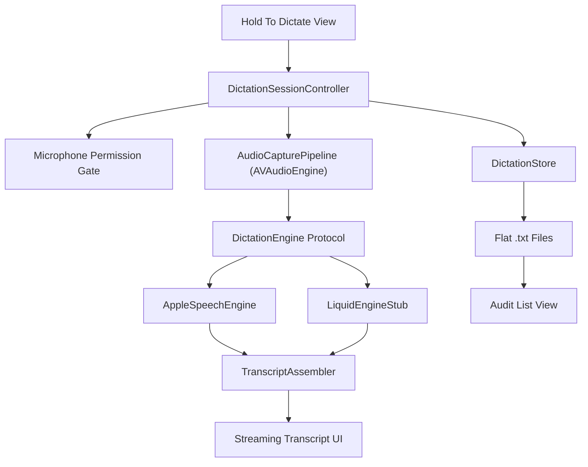
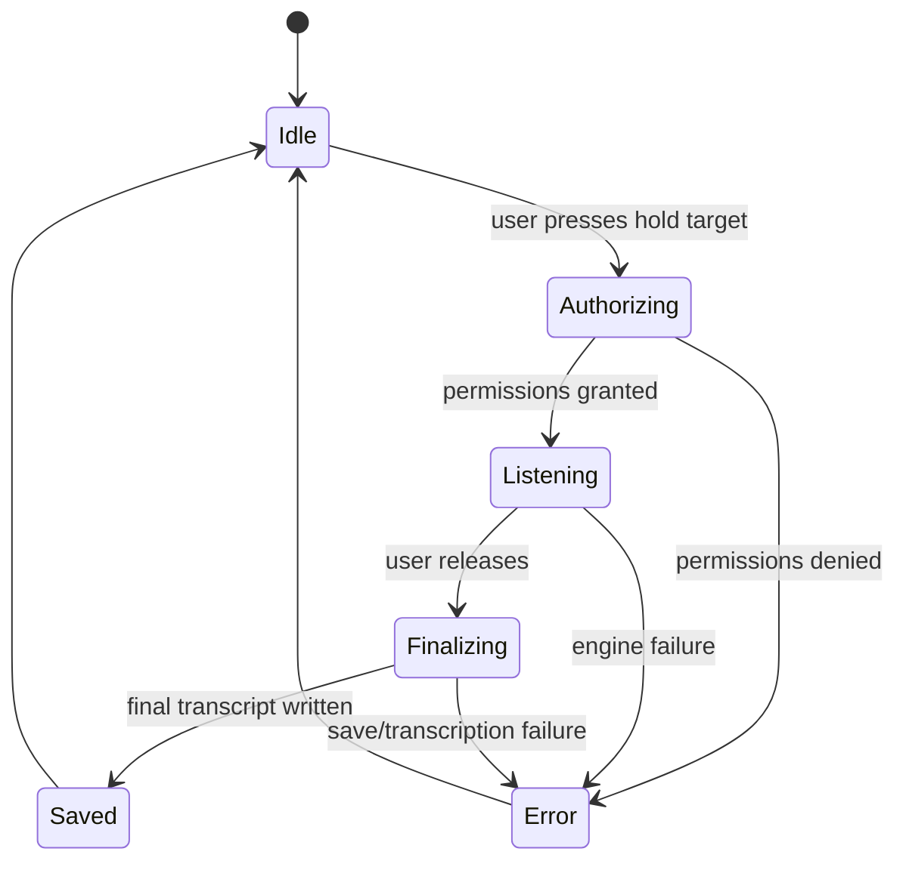

# Minimal Dictation Architecture

## Product goal

Build the smallest possible iOS dictation app with a clean `press and hold` interaction:

- Hold the main button to start dictation.
- Show streaming text while the user is still speaking.
- Release to stop and save the final transcript locally.
- Keep a dead-simple audit list of previous dictations stored as flat text files.

## UX reference from `theVoid`

The part worth copying from `theVoid` is the interaction shape, not the feature set:

- Big central hold target.
- Immediate visual feedback when recording starts.
- Clear start / recording / stop states.

`theVoid` currently records audio first and only transcribes after the file is finished:

- `ViewsVoid.swift` uses a press-and-hold control to start and stop recording.
- `AudioAndDraft.swift` records `.m4a` audio with `AVAudioRecorder`.
- `LocalReflectionAnalyzer.swift` runs `SFSpeechURLRecognitionRequest` on the saved file afterward.

That is the main thing we need to change.

## Core decision

To get live text while the button is down, the app cannot be built around `record file -> transcribe file later`.

It should be built around:

1. `AVAudioEngine` capturing live PCM buffers.
2. A provider-agnostic `DictationEngine` that consumes those buffers.
3. A `TranscriptAssembler` that updates the UI as partial text arrives.
4. A tiny flat-file store that saves only the final text for audit.

## MVP architecture



## Session flow



## Engine boundary

This is the seam that lets us swap Apple Speech and Liquid without rewriting the UI:

```swift
import AVFoundation

struct DictationUpdate: Sendable {
    let committedText: String
    let liveText: String
    let isFinal: Bool
}

protocol DictationSession: AnyObject {
    var updates: AsyncStream<DictationUpdate> { get }
    func append(_ buffer: AVAudioPCMBuffer, at time: AVAudioTime?) throws
    func finish() async throws -> String
    func cancel()
}

protocol DictationEngine {
    func prepare() async throws
    func makeSession(locale: Locale) async throws -> DictationSession
}
```

### Apple adapter

Use first for v1.

- Backed by `SFSpeechAudioBufferRecognitionRequest`.
- Accepts live microphone buffers.
- Emits partial transcription updates while recording is active.
- Produces the final text on `finish()`.

### Liquid adapter

Keep behind the same protocol, but treat it as a stub at first.

Reason:

- Liquid's iOS docs currently document audio input as WAV data in a message, not incremental microphone chunk ingestion.
- Liquid's iOS docs require mono PCM WAV, ideally `16 kHz`.
- Liquid does document streaming text responses from `generateResponse(...)`, but the documented iOS input flow is still file/blob style audio input.
- Liquid's real-time transcription example is currently documented as a desktop `llama.cpp` example.

Inference:

The safest first cut is:

- Ship Apple live streaming dictation first.
- Keep the Liquid adapter behind the same interface.
- Start the Liquid adapter as `not implemented` or as a batch-on-finish experiment until we validate an iOS-friendly real-time path.

## Transcript model

Do not bind the UI directly to provider output strings. Keep one small assembler:

- `committedText`: stable text we are confident in.
- `liveText`: the latest mutable tail from the provider.
- `displayText = committedText + liveText`.

This matters because partial transcripts often revise the last few words.

## Storage

Keep storage deliberately dumb.

Recommended layout:

```text
Documents/
  Dictations/
    2026-04-12T18-05-11.txt
    2026-04-12T18-09-44.txt
```

Each file contains only the final transcript text.

Optional later:

- Store a sidecar `.json` if we need timestamps or engine metadata.
- Store raw `.wav` only for debugging or provider fallback experiments.

For the audit list:

- Scan the directory on launch.
- Sort by filename descending.
- Show the first line or first ~120 characters as preview.
- Tap to open the full text.

No database is needed.

## Minimal screens

Only two screens are needed for MVP:

1. `DictationView`
   Shows the hold target, live transcript, and current state.
2. `AuditListView`
   Shows saved flat text dictations newest first.

## Recommended file/module split

```text
suprise/
  Dictation/
    DictationView.swift
    HoldToDictateControl.swift
    DictationSessionController.swift
    AudioCapturePipeline.swift
    DictationEngine.swift
    AppleSpeechDictationEngine.swift
    LiquidDictationEngine.swift
    TranscriptAssembler.swift
  Storage/
    DictationStore.swift
  Audit/
    AuditListView.swift
```

## What to copy from `theVoid` vs what to drop

Copy:

- The press-and-hold affordance.
- The strong single-purpose focus on the main interaction.
- The low-friction full-screen recording surface.

Drop:

- Drafts, tagging, journal models, onboarding complexity, social, tabs, analysis, cloud sync.
- Post-recording-only transcription.
- AAC / `.m4a` as the primary capture format for live dictation.

## Implementation order

1. Build `DictationView` plus the `PressAndHoldControl`.
2. Replace file-first recording with `AVAudioEngine` live buffer capture.
3. Implement `AppleSpeechDictationEngine` with partial updates.
4. Save final text into flat `.txt` files and render the audit list.
5. Add `LiquidDictationEngine` as a protocol-backed stub, then iterate on integration separately.

## References

- `theVoid` hold interaction: `/Users/zubinaysola/Documents/personal/lowercaseLabs/theVoidLocal/theVoid/theVoid/ViewsVoid.swift`
- `theVoid` recorder: `/Users/zubinaysola/Documents/personal/lowercaseLabs/theVoidLocal/theVoid/theVoid/AudioAndDraft.swift`
- `theVoid` post-recording speech transcription: `/Users/zubinaysola/Documents/personal/lowercaseLabs/theVoidLocal/theVoid/theVoid/LocalReflectionAnalyzer.swift`
- Liquid iOS audio input docs: https://docs.liquid.ai/deployment/on-device/ios/messages-content
- Liquid iOS streaming response docs: https://docs.liquid.ai/deployment/on-device/ios/conversation-generation
- Liquid real-time transcription example: https://docs.liquid.ai/examples/laptop-examples/audio-to-text-in-real-time
